# Janji
Saya Nabila Attaya Putri Cahyadi dengan NIM 2508355 mengerjakan Tugas Praktikum 1 pada Mata Kuliah Desain dan Pemrograman Berorientasi Objek (DPBO) untuk keberkahan-Nya maka saya tidak melakukan kecurangan seperti yang telah dispesifikasikan. Aamiin
  
# 📂 Struktur File
```text
TP1DPBO2526C1/
├── README.md
│
├── cpp/
│   ├── CinemaFilm.cpp
│   └── main.cpp
│
├── java/
│   ├── CinemaFilm.java
│   └── Main.java
│
├── python/
│   ├── CinemaFilm.py
│   └── main.py
│
├── php/
│   ├── CinemaFilm.php
│   ├── index.php
│   └── images/
│       ├── absolute_cinema.png
│       ├── film_6aafe322031dc7.06386470.jpg
│       ├── film_6aafe34e8432d1.79738288.jpg
│       ├── film_6aafe38e39e4e3.06273261.png
│       └── film_6aafea428073d7.43900986.jpg
│
└── dokumentasi/
    │
    ├── cpp/
    │   ├── add.png
    │   ├── delete.jpg
    │   ├── display.jpg
    │   ├── error_handling.jpg
    │   ├── exit.jpg
    │   ├── search.jpg
    │   ├── update.jpg
    │   └── welcome.jpg
    │
    ├── java/
    │   ├── add.png
    │   ├── delete.jpg
    │   ├── display.jpg
    │   ├── error_handling.jpg
    │   ├── exit.jpg
    │   ├── search.jpg
    │   ├── update.jpg
    │   └── welcome.jpg
    │
    ├── php/
    │   ├── add1.png
    │   ├── add2.png
    │   ├── delete1.jpg
    │   ├── delete2.jpg
    │   ├── display.jpg
    │   ├── error_handling.jpg
    │   ├── search.jpg
    │   ├── update1.jpg
    │   └── update2.jpg
    │
    └── python/
        ├── add.png
        ├── delete.jpg
        ├── display.jpg
        ├── error_handling.jpg
        ├── exit.jpg
        ├── search.jpg
        ├── update.jpg
        └── welcome.jpg
```
  
# 📖 Penjelasan Desain
Program terdiri dari 1 kelas yaitu CinemaFilm yang memiliki atribut:
- filmCode (Kode film)
- filmTitle (Judul film)
- filmGenre (Genre film)
- filmDuration (Durasi film dalam menit)
- ticketPrice (Harga tiket film dalam US dollar)
- filmRating (Rating film dari 10)
- filmImage (Gambar film KHUSUS PHP!)

  
# 🔴 Error Handling
### 1. command tidak didefinisikan
### 2. /add
    - filmCode tidak sesuai format
    - filmCode duplikat
    - filmGenre diluar list yang disediakan
    - filmDuration bukan angka, negatif, desimal, atau lebih dari batas
    - ticketPrice bukan angka, negatif, desimal, atau lebih dari batas
    - filmRating bukan angka, negatif, desimal, atau lebih dari batas
    - filmImage tidak di submit (khusus PHP)
### 3. /update
    - filmCode tidak sesuai format
    - filmCode duplikat
    - filmGenre diluar list yang disediakan
    - filmDuration bukan angka, negatif, desimal, atau lebih dari batas
    - ticketPrice bukan angka, negatif, desimal, atau lebih dari batas
    - filmRating bukan angka, negatif, desimal, atau lebih dari batas
    - filmImage tidak di sub
### 4. /delete, /search
    - filmCode tidak ditemukan

  
# 📷 Dokumentasi
## 1. C++
  
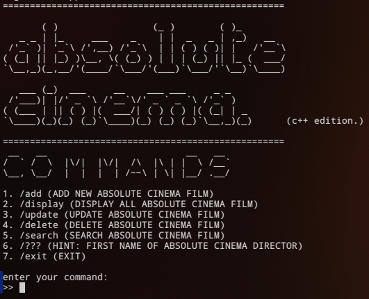
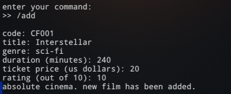
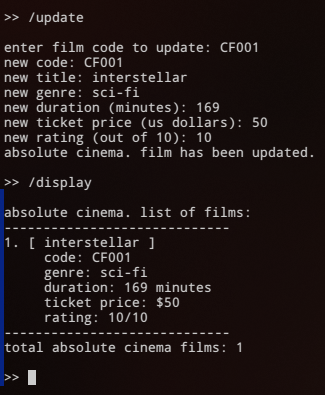
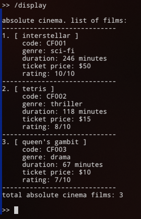
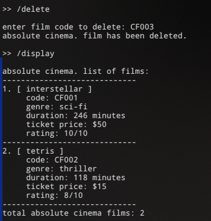
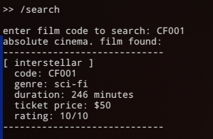
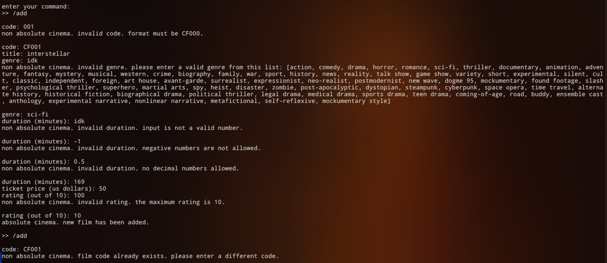
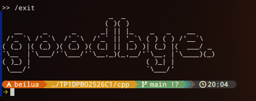
  
## 2. Java
  
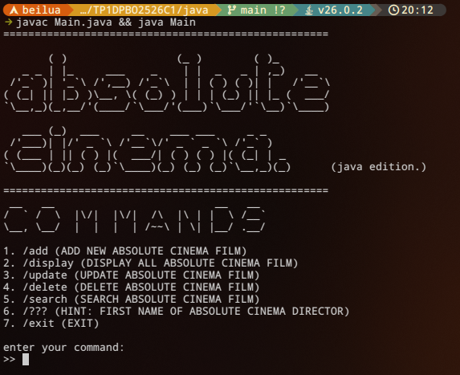
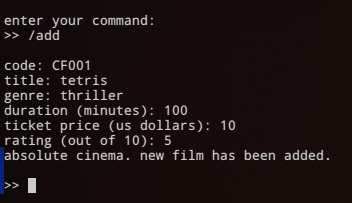
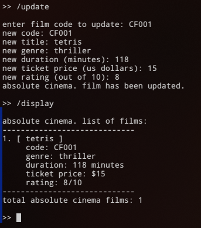
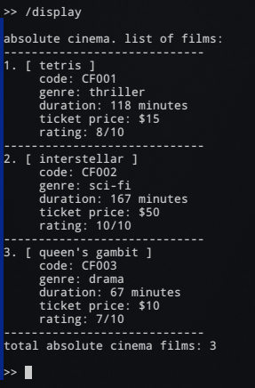
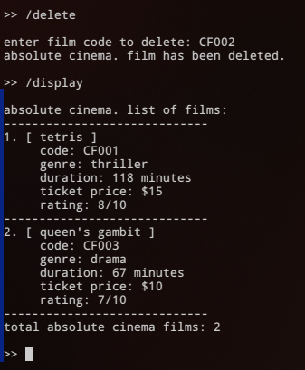
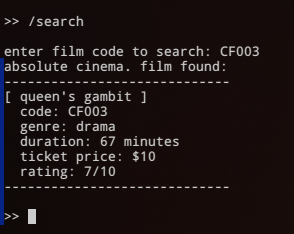
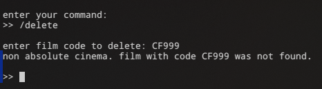
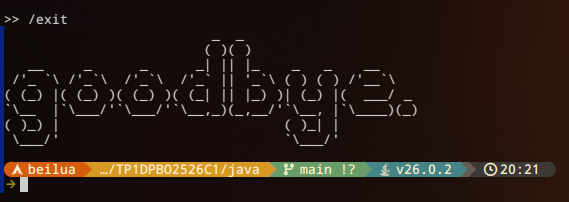
  
## 3. Python
  
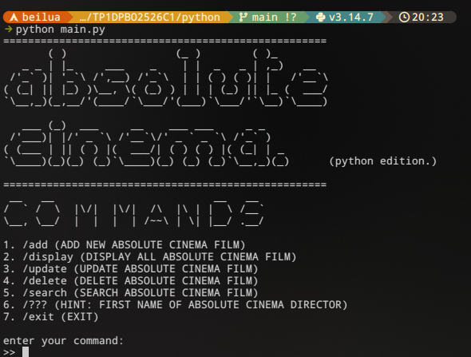
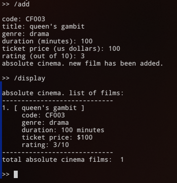
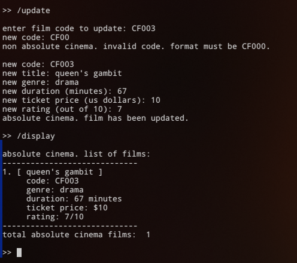
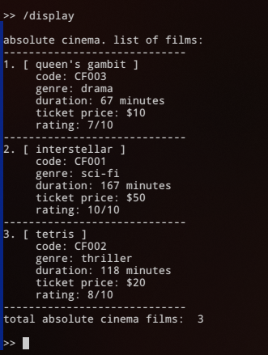
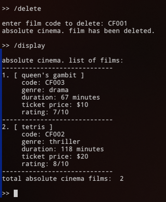
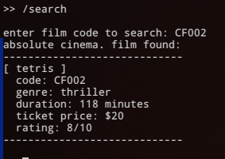
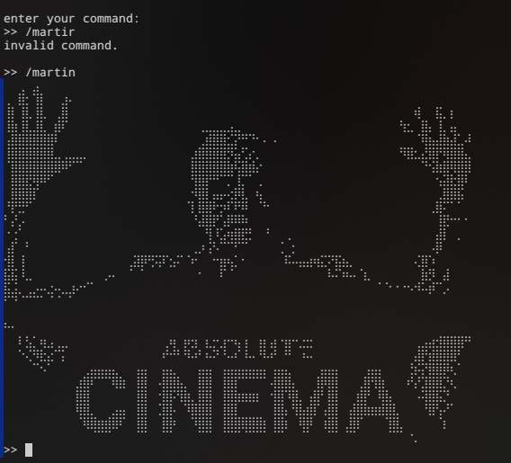
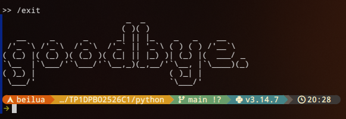
  
## 4. PHP
  
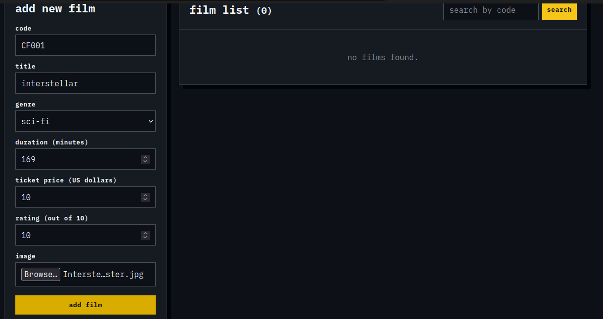
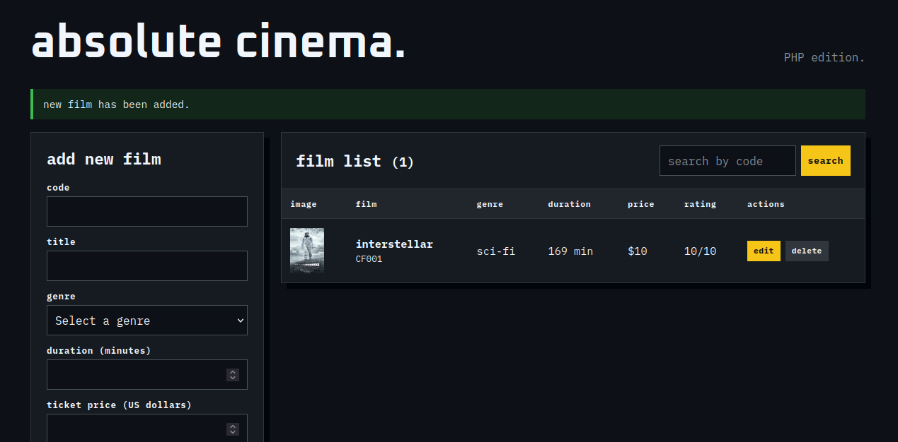
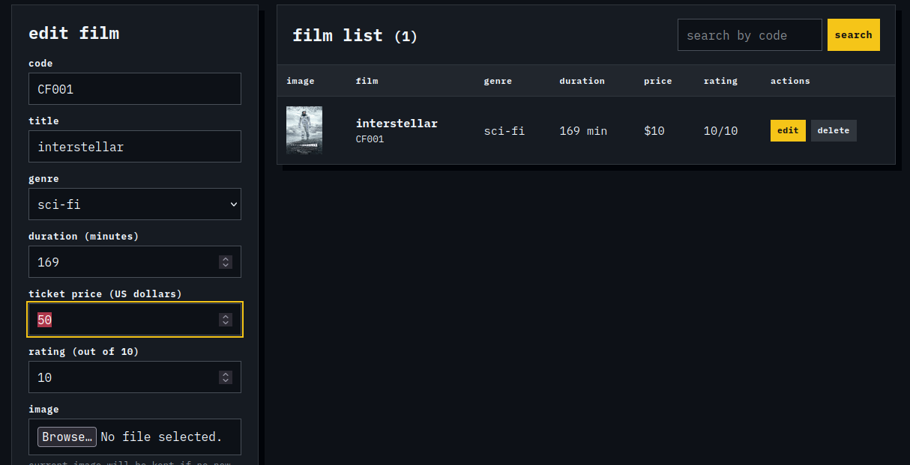
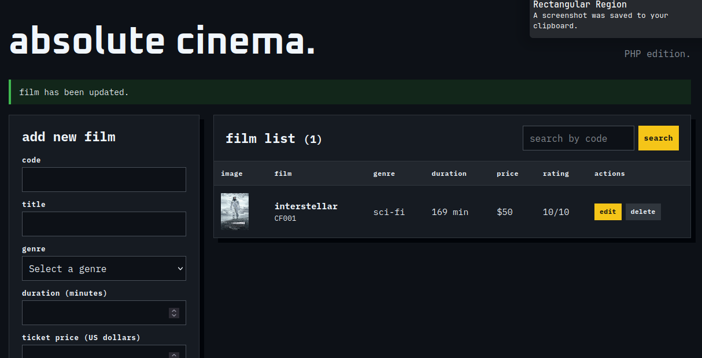
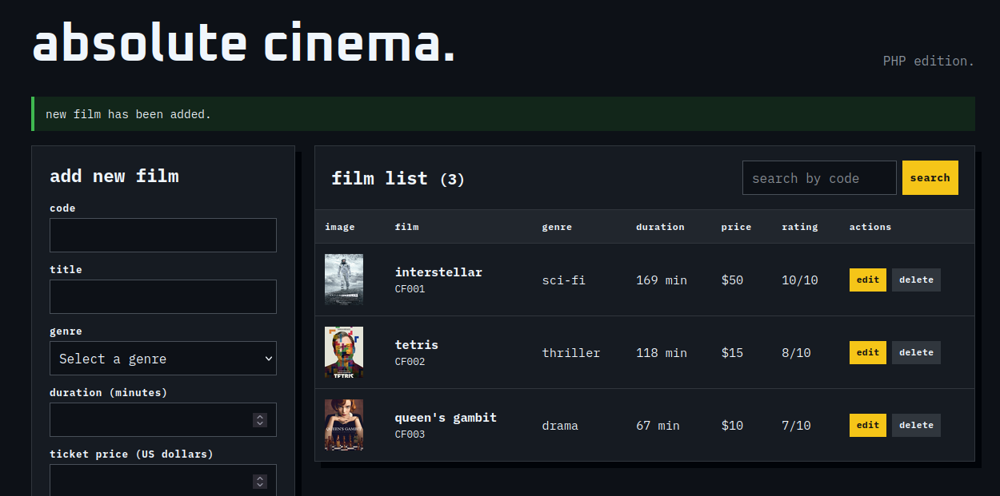
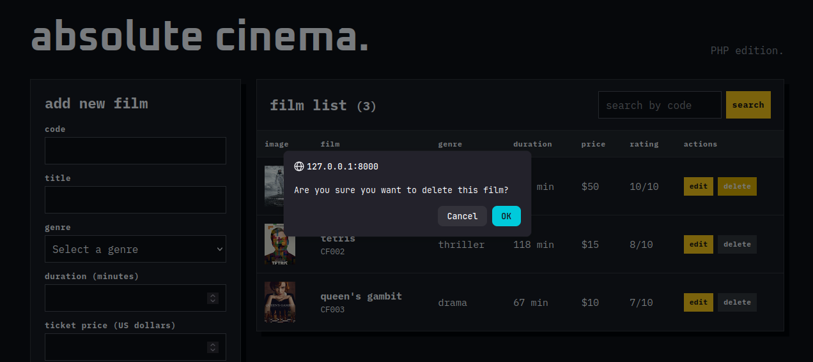
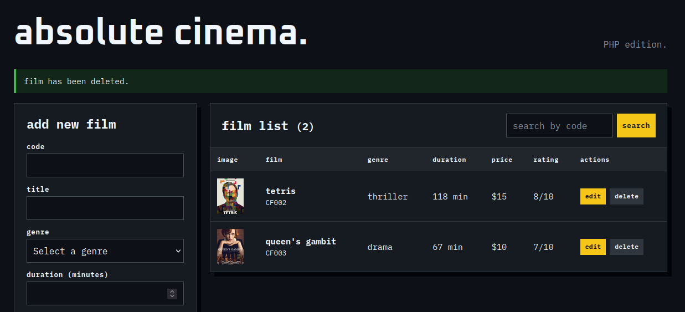
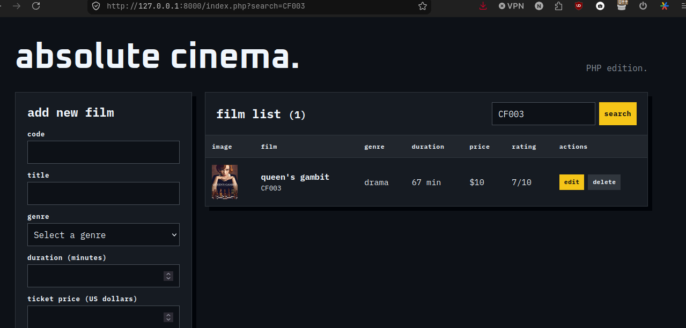
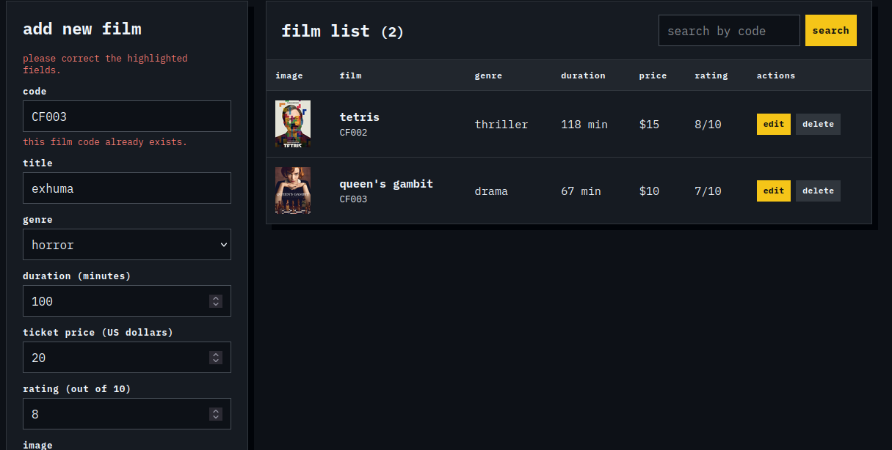
